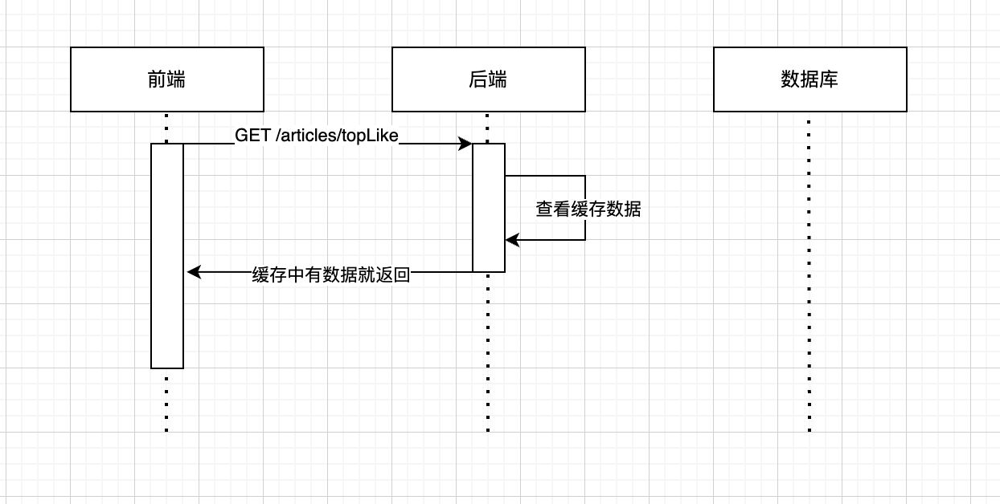
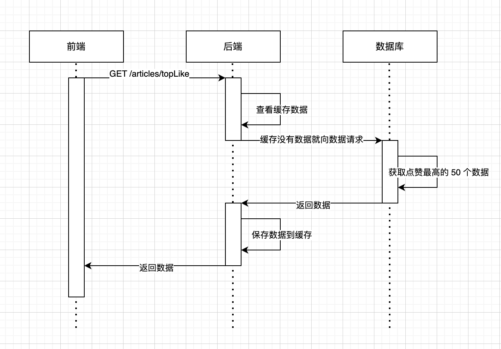

## 实现思路
1. 给 `Interactive` 中的 `LikeCnt` 添加索引
2. 获取点赞数最高的帖子，先查看 `redis` 缓存中是否有数据，否则就从数据库中重新获取，并保存到 `redis`
3. 缓存中的数据仅保存 5 分钟（可以自己选择时长），这个数据的实时性不需要那么高，所以每 5 分钟重新获取一次
这也避免了频繁访问数据库，也保持了一定的实时性。

## UML
#### 命中缓存


#### 未命中缓存


## wrk
命令：`wrk -t10 -c200 -d10s -s ./scripts/wrk/checkTopLike.lua http://127.0.0.1:8080/articles/topLike`
电脑配置：MacBook Pro M3 16GB的内存

#### 没缓存运行结果：
```
Running 10s test @ http://127.0.0.1:8080/articles/topLike
  10 threads and 200 connections
  Thread Stats   Avg      Stdev     Max   +/- Stdev
    Latency    57.41ms   50.44ms   1.11s    98.67%
    Req/Sec   365.67     44.56   450.00     89.98%
  36412 requests in 10.02s, 190.04MB read
  Socket errors: connect 0, read 61, write 0, timeout 0
Requests/sec:   3634.70
Transfer/sec:     18.97MB
```

#### 有缓存运行结果：
```
Running 10s test @ http://127.0.0.1:8080/articles/topLike
10 threads and 200 connections
Thread Stats   Avg      Stdev     Max   +/- Stdev
    Latency    31.66ms    6.43ms 133.97ms   97.53%
    Req/Sec   638.12     61.46   727.00     94.37%
63380 requests in 10.02s, 332.97MB read
Socket errors: connect 0, read 66, write 0, timeout 0
Requests/sec:   6328.16
Transfer/sec:     33.25MB
```
