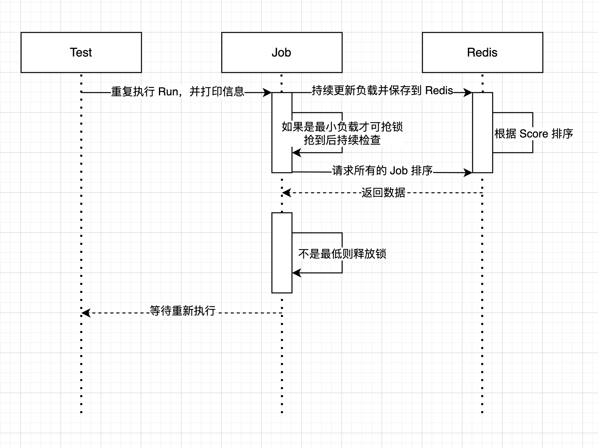

## 做题思路

1. 创建 `Job` 对象，并启动一个 `Goroutine` 来持续更新负载均衡。
2. 每 2 秒执行一次所有的 `Job` 的 `Run` 方法
3. 执行 `Run` 方法后，检查当前节点是否为最小负载，如果是才可抢锁。
4. 如果某个 `Job` 成功抢到锁，则启动一个监控的 `Goroutine` 来检查当前节点是否为最小的负载节点。
5. 如果是则什么都不做，如果不是则释放锁。

## 最坏情况
以当前的代码情况，是没有可能抢到最差的节点的，但是即使选中了也没事，因为会一直检查当前节点的负载。

如果当前节点宕机了，只要将它 `Close` 它就不会出现在 `Redis` 的列表中，就不会被选中了。
